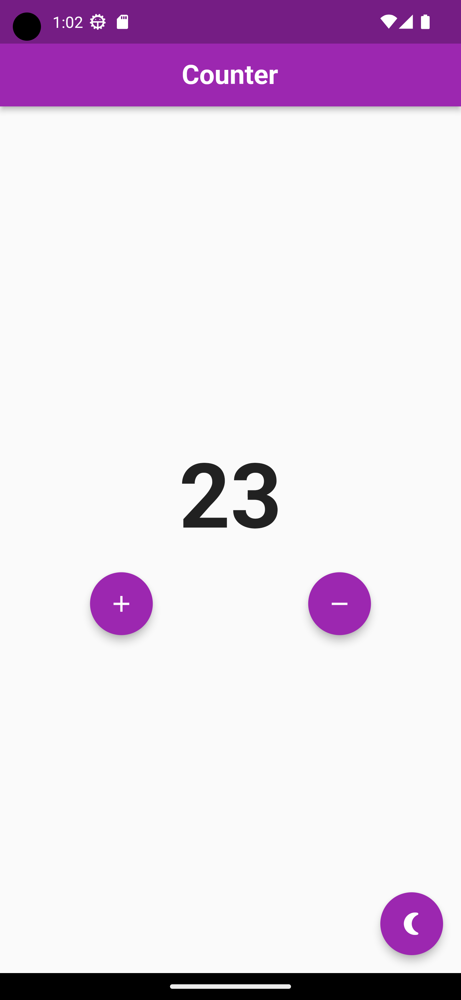
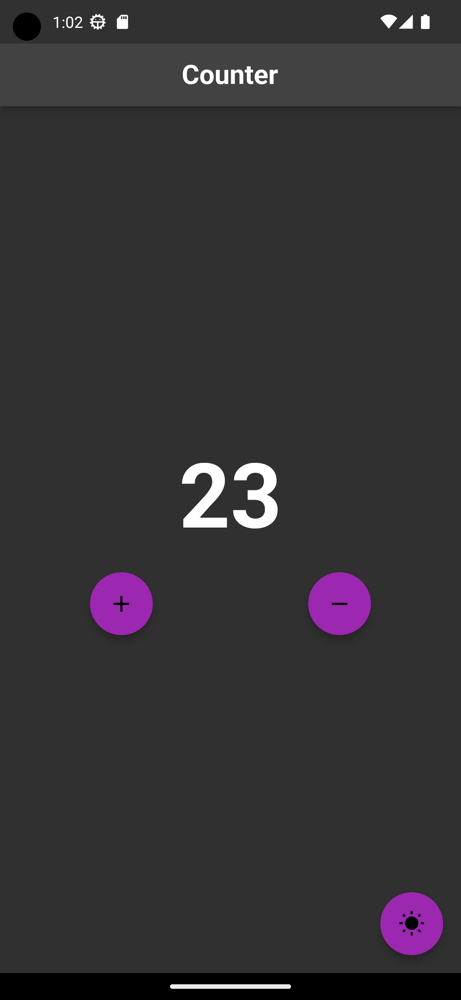

# Counter App

This is a simple Flutter app that displays a counter and allows you to increment or decrement its value. It also provides a toggle to switch between light and dark themes.

## Features

- Display the current counter value
- Increment the counter value
- Decrement the counter value (if it's greater than 0)
- Toggle between light and dark themes

## Getting Started

To use this app, follow these steps:

1. Ensure you have Flutter installed on your machine.
2. Clone this repository or download the source code.
3. Open the project in your preferred code editor.
4. Run the app using the Flutter command-line tools or an integrated development environment (IDE).

## Dependencies

This app uses the following dependencies:

- `flutter/material.dart`: Provides the Flutter material design widgets and classes.

## Demo

The following screenshots show the app in action:

## How It Works

The app consists of a single Flutter `StatefulWidget` called `MyApp`. It maintains the state of the counter value (`_counter`) and the current brightness (`_currentBrightness`). The brightness determines the theme of the app.

The `MyApp` widget is the root widget of the app and is created in the `main` function using the `runApp` method.

The `build` method of the `MyApp` widget creates the user interface of the app using various Flutter widgets. It uses the `MaterialApp` widget as the top-level widget, which provides basic material design components and sets up the app's theme.

The app's UI consists of a `Scaffold` widget that contains an `AppBar` at the top and a `Column` in the body. The `AppBar` displays the title of the app, and the `Column` contains the counter value, increment and decrement buttons, and the toggle theme button.

The counter value is displayed using a `Text` widget, and the increment and decrement buttons are implemented using `FloatingActionButton` widgets.

The `onPressed` callbacks of the buttons are wired up to the corresponding methods in the `_MyAppState` class, which call `setState` to update the UI when the counter value or theme changes.

The app's theme is defined using the `ThemeData` class. It provides different styles for light and dark themes, including the text styles for various widgets.

The toggle theme button's icon changes based on the current brightness state, indicating whether the app is currently using the light or dark theme. Tapping the button calls the `_toggleTheme` method to switch between the two themes.

